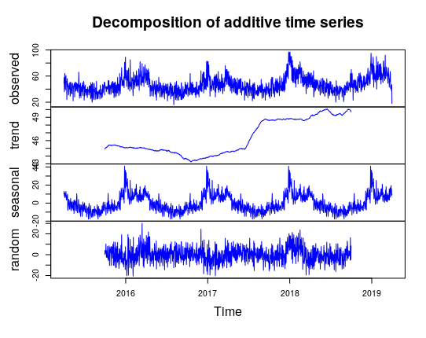

## Explatory exercise using time series methods. 
This repositoy register the main results obtained during a explatory exercise of forecasting using R. I applied some time series methods to identify any pattern in the data of a local walk-in health centre. Then, I predicted the number of patients using forecast methods. The original exercise was part of an assingment that I have done during my MSc course at Cardiff University. 

It is important to destak that I am not trying to find which variables explain the dynamic of the series. In this exercise of time series and forecasting, I am just pay attention at the patterns of the serie in order to better forecast it. 

If you are looking for a method to understand which factors/variables impact on your data, time series models is not suitable for this purpose  

## Getting Started

It is necessary to download the dataset avaliable in this repository: [TimeSeries_example](TimeSeries_example.xlsx). This file is a fictional dataset built to practise time series methods. The period cover by dataset is from 01/04/15 to 31-03-19. 

## Prerequisites

Which packages and libraries you need to install:

```
#To import excel file
install.packages("readxl")
library(readxl)

#Work with Date and times
install.packages('lubridate')
library('lubridate')

#Basics stats
install.packages('pastecs')
library('pastecs')
install.packages('DescTools')
library('DescTools')

#Graphics
install.packages('fpp2')
library('fpp2')

```

## Data analysis

Is there any pattern in the daily number of patients at a local walk-in centre? 

We can start plotting a graph and making some basic statistics to figure out which kind of dataset we are working.
```
#Import the file to R including the correct path where you save the file
TimeSeries_example <- read_excel("TimeSeries_example.xlsx")

#saving as time series object
dt_1 <- ts(TimeSeries_example[,2],start = decimal_date(as.Date("2015-04-01")), frequency = 365)

#plot the first graph to visualise which kind of data we are working
plot(dt_1, main="Number of patients per day", sub="01 April 2015 - 31 March 2019", col = 'Blue', xlab="Year", ylab="number of Patients")

```


... and the basics statistics 

```
stat.desc(dt_1)
mean(dt_1)
median(dt_1)
mean(abs(dt_1-mean(dt_1)))
mean((dt_1-mean(dt_1))^2)
var(dt_1)
sd(dt_1)
min(dt_1)
max(dt_1)
```

- Data Period: 01/04/15 – 31-03-19;
- Number of Obervations (days): 1,461;
- Mean: 46.72 / Mean abs. Dev.: 9.94 / Mean Sqd dev: 166.57 / Variance: 166.69 / St.dev: 12.91 / Mininum: 16 and Maximum: 97

From the graph, it is possible to recognise a time series pattern in our dataset. So, let's decompose 

# Decomposition

The purpose of decomposition methods is identify the sub components of the dataset: 

- trend-cycle: The trend-cycle represents longer term changes in the series (trend and cyclical components) 

- seasonal factor: it relates to a 'constant' fluctuations with periodic length. For instance, temperature along the year as a seasonal behaviour according with the month

- random: containing anything else in the time series

```
decomp_1 <- decompose(dt_1, type = 'additive')
plot(decomp_1, col = 'blue')

```


From the graph, we can note two main Visual Patterns:  

Seasonality - more patients during weekends and winter months. 

Positive Trend after mid-2017


## Train and test set

Before apply the time series models, we need to divide our dataset into train (70%) and test sets (30%). This avoids future problems ir our results such as overfitting. Futhermore, it help us to get a better accuracy of our predictions points.


```
train<- subset(dt_1, end = 1023) #70% of the total dataset
test <- subset(dt_1, start = 1024) #30% of the total dataset

```

## Time series models

I did a investigation of a a selected time series models to see which model provides a good fit to the observed data.

- Baseline & simple approaches, including: Seasonal Naïve, Moving Average, Simple Linear Regression.

  - Seasonal Naive: each forecast point will be equal to the last observed value from the same point of the previous year
  - Moving average: it is a classic method applied to smooth and decompose the time series data. But it can be also applied to make forecast. 
  - Simple linear regression: the classic linear regression applied to forecast. 

- A little more complex approaches including: SES, Holt Linear, Holt Winters, Multiple Linear Regression, ARIMAs.

  - SES: 


```
#Baseline models - seasonal Naive

baseline_model <- snaive(train, h = (1461-1023))

#Exponential models

ses_model <- ses(train, h = (1461-1023))
holt_model <- holt(train, h = (1461-1023))
holt_w_model <-HoltWinters(train, season = 'mult')

#regression models

linear_model <- tslm(Pacients~Time,data=train)
multi_model <- tslm(train~trend+season)

#Arima


```


## Authors

* **Jonas Okawara** 

## License

This project is licensed under the MIT License - see the [LICENSE](LICENSE) file for details

## References

Hyndman, R.J., & Athanasopoulos, G. (2018) Forecasting: principles and practice, 2nd edition, OTexts: Melbourne, Australia. OTexts.com/fpp2. Accessed on <26/05/2020>. link: https://otexts.com/fpp2/index.html
