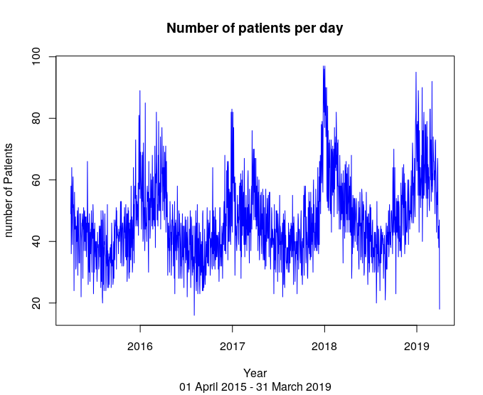

## Explatory exercise using time series methods. 
This repositoy register the main results obtained during a explatory exercise of forecasting using R. I applied some time series methods to identify any pattern in the data of a local walk-in health centre. Then, I predicted the number of patients using forecast methods. The original exercise was part of an assingment that I have done during my MSc course at Cardiff University. 

It is important to destak that I am not trying to find which variables explain the dynamic of the series. In this exercise of time series and forecasting, I am just pay attention at the patterns of the serie in order to better forecast it. 

If you are looking for a method to understand which factors/variables impact on your data, time series models is not suitable for this purpose  

## Getting Started

It is necessary to download the dataset avaliable in this repository: [TimeSeries_example](TimeSeries_example.xlsx). This file is a fictional dataset built to practise time series methods. The period cover by dataset is from 01/04/15 to 31-03-19. 

## Prerequisites

Which packages and libraries you need to install:

```
#To import excel file
install.packages("readxl")
library(readxl)

#Work with Date and times
install.packages('lubridate')
library('lubridate')

#Basics stats
install.packages('pastecs')
library('pastecs')
install.packages('DescTools')
library('DescTools')

#Graphics
install.packages('fpp2')
library('fpp2')

#Forecasting
library(forecast)

```

## Data analysis

Is there any pattern in the daily number of patients at a local walk-in centre? 

We can start plotting a graph and making some basic statistics to figure out which kind of dataset we are working.
```
#Import the file to R including the correct path where you save the file
TimeSeries_example <- read_excel("TimeSeries_example.xlsx")

#saving as time series object
dt_1 <- ts(TimeSeries_example[,2],start = decimal_date(as.Date("2015-04-01")), frequency = 365)

#plot the first graph to visualise which kind of data we are working
plot(dt_1, main="Number of patients per day", sub="01 April 2015 - 31 March 2019", col = 'Blue', xlab="Year", ylab="number of Patients")

```


... and the basics statistics 

```
stat.desc(dt_1)
mean(dt_1)
median(dt_1)
mean(abs(dt_1-mean(dt_1)))
mean((dt_1-mean(dt_1))^2)
var(dt_1)
sd(dt_1)
min(dt_1)
max(dt_1)
```

- Data Period: 01/04/15 – 31-03-19;
- Number of Obervations (days): 1,461;
- Mean: 46.72 / Mean abs. Dev.: 9.94 / Mean Sqd dev: 166.57 / Variance: 166.69 / St.dev: 12.91 / Mininum: 16 and Maximum: 97

## ACF and PACF
```
auto_correl <- ggAcf(dt_1)
ggtsdisplay(dt_1)

```

From the graph, it is possible to recognise a time series pattern in our dataset. So, let's decompose 

## Decomposition

The purpose of decomposition methods is identify the sub components of the dataset: 

- trend-cycle: The trend-cycle represents longer term changes in the series (trend and cyclical components) 

- seasonal factor: it relates to a 'constant' fluctuations with periodic length. For instance, temperature along the year as a seasonal behaviour according with the month

- random: containing anything else in the time series

```
decomp_1 <- decompose(dt_1, type = 'additive')
plot(decomp_1, col = 'blue')
```


From the graph, we can note two main Visual Patterns:  

Seasonality - more patients during weekends and winter months. 

Positive Trend after mid-2017


## Train and test set

Before apply the time series models, we need to divide our dataset into train (70%) and test sets (30%). This avoids future problems ir our results such as overfitting. Futhermore, it help us to get a better accuracy of our predictions points.


```
train<- subset(dt_1, end = 1023) #70% of the total dataset
test <- subset(dt_1, start = 1024) #30% of the total dataset
```

## Time series models

I did a investigation of a a selected time series models to see which model provides a good fit to the observed data.

- Baseline & simple approaches, including: Seasonal Naïve, Moving Average, Simple Linear Regression.

  - Seasonal Naive: each forecast point will be equal to the last observed value from the same point of the previous year
  - Moving average: it is a classic method applied to smooth and decompose the time series data. But it can be also applied to make forecast. 
  - Simple linear regression: the classic linear regression applied to forecast. 

- A little more complex approaches including: SES, Holt Linear, Holt Winters, Multiple Linear Regression, ARIMAs.

  - SES: Single Exponential Smoothing is applied in data with no trend or seasonal components. 
  - Holt Linear: it is a exponential smoothing with two equations (one for level and other for the trend)
  - Holt winters: it considers three smoothing equations (level, trend and seasonal)
  - Multiple linear regression: the classic minimising the sum of the squared errors 
  - Arima: Autoregressive integrated moving average (ARIMA) is the most famous method. In this exercise, I will only focus to identy the appropriate model.


```
#Baseline models - seasonal Naive

baseline_model <- snaive(train, h = (1461-1023))

#Exponential models

ses_model <- ses(train, h = (1461-1023))
holt_model <- holt(train, h = (1461-1023))
holt_w_model <-HoltWinters(train, season = 'mult')

#regression models

linear_model <- tslm(Pacients~Time,data=train)
multi_model <- tslm(train~trend+season)

#Arima

#treatment
BoxCox.lambda(dt_1)
dif_1 <- diff(log(dt_1))
autoplot(dif_1)

#arima steps
arima_fit <- auto.arima(train, lambda = -0.679727, seasonal = TRUE) #this lambda I found applying BoxCox.lambda(function)
```

## Error analysis

```
checkresiduals(baseline_model)
checkresiduals(ses_model)
checkresiduals(holt_model)
checkresiduals(holt_w_model)
checkresiduals(linear_model)
checkresiduals(multi_model)

...and I also did two functions to plot others errors stats

error_fun = function(x,y){
  m <- me(x$mean,y)
  r <- RMSE(x$mean,y)
  ma <- mae(x$mean,y)
  mpe <- MPE(x$mean,y)
  map <- mape(x$mean,y)
  mas <- mase(x$mean,y)
  return(c(m,r,ma,mpe,map,mas))
}

error_fun_2 = function(x,y){
  m <- me(x,y)
  r <- RMSE(x,y)
  ma <- mae(x,y)
  mpe <- MPE(x,y)
  map <- mape(x,y)
  mas <- mase(x,y)
  return(c(m,r,ma,mpe,map,mas))
}

#ME: Mean Error
install.packages('hydroGOF')
library('hydroGOF')
me(baseline_model$mean,test)
#RMSE: Root Mean Squared Error
RMSE(baseline_model$mean, test)
#MAE: Mean Absolute Error
mae(baseline_model$mean,test)
#MPE: Mean Percentage Error
MPE = function(x,y){
  n = length(x)
  mpe = 100/n * sum((x-y)/x)
  return(mpe)
}

MPE(baseline_model$mean,test)
#MAPE: Mean Absolute Percentage Error
install.packages('Metrics')
library('Metrics')
mape(baseline_model$mean,test)
#MASE: Mean Absolute Scaled Error
mase(baseline_model$mean,test)

#then, I applied it to the models

error_fun(baseline_model,test)
error_fun(ses_model,test)
error_fun(holt_model,test)
error_fun_2(predict_linear[,1], test_2[,1])
error_fun_2(linear_model$fitted.values, train_2[,1])
error_fun_2(multi_model$fitted.values,train)
error_fun_2(predict_multi$mean,test)
error_fun_2(fore_arima$mean,test)

```

## Forecasting

```
#forecast naive
f_7_base <- snaive(train, h = (1468-1023)) #forecast 7 days
tail(f_7_base$mean) 

#forecast ses
f_7_ses <- ses(train, h = (1468-1023))
tail(f_7_ses$mean) 

#forecast holt linear
f_7_holt<-holt(train, h = (1468-1023))
f_7_holt$mean

#forecast holt winter
f_7_holt_w <- predict(holt_w_model, n.ahead =(1468-1023),prediction.interval = TRUE)
f_7_holt_w[,1]

#forecast linear regression 
f_7_lin_reg <-ts(predict.lm(linear_model,newdata = test_2,interval = 'confidence',h=7))
f_7_lin_reg[,1]

#forecast multi-linear regression 
f_7_mult_reg <-forecast(multi_model,newdata = test,h=438)
f_7_mult_reg$mean

#forecast arima
f_7_arima <- forecast(arima_fit, lambda= -0.679727,h=(1468-1023))
f_7_arima$mean
```

## Graph analysis
```
#graph models forecast part - regression  
autoplot(dt_1)+
  autolayer(test, series = 'Test') +
  autolayer(train, series = 'Train') +
  autolayer(linear_model_2$fitted.values, series = 'Linear Model') +
  autolayer(multi_model$fitted.values, series = 'Fitted - multi Model') +
  autolayer(predict_multi$mean, series = 'Forecast - Mult Model') +
  xlab('Time')+
  ylab('Pacients')+
  guides(colour=guide_legend(title="Data series"), 
         fill=guide_legend(title="Prediction interval")) +
  scale_color_manual(values=c('blue','red','orange','grey', "black"))

#colour
clrs <- c("red","blue", "black")
#function of the graph
graph_plot = function(x,y,z){
  autoplot(x)+ 
    autolayer(x$mean,series = 'Forecast') +
    autolayer(y, series = 'Train') +
    autolayer(z, series = 'Test') +
    xlab('Observation') +
    ylab('number of Pacients')+
    guides(colour=guide_legend(title="Data series"), 
           fill=guide_legend(title="Prediction interval")) +
    scale_color_manual(values=clrs)

}

#model of the graph - forecast
autoplot(test)+ 
  autolayer(baseline_model$mean,series = 'Snaive - Forecast') +
  autolayer(ses_model$mean,series = 'Ses - Forecast') +
  autolayer(holt_model$mean,series = 'Holt Linear - Forecast') +
  autolayer(predict_holt[,1],series = 'Holt winter - Forecast') +
  autolayer(test, series = 'Test') +
    xlab('Observation') +
  ylab('number of Pacients')+
  guides(colour=guide_legend(title="Data series"), 
         fill=guide_legend(title="Prediction interval")) +
  scale_color_manual(values=c("red",'green','blue',"grey", "black"))

#model of the graph - observed
autoplot(train, series = 'Train')+ 
  autolayer(baseline_model$fitted,series = 'Snaive - Forecast') +
  autolayer(ses_model$fitted,series = 'Ses - Forecast') +
  autolayer(holt_model$fitted,series = 'Holt Linear - Forecast') +
  #autolayer(holt_w_model$fitted,series = 'Holt winter - Forecast') +
  xlab('Observation') +
  ylab('number of Pacients')+
  guides(colour=guide_legend(title="Data series"), 
         fill=guide_legend(title="Prediction interval")) +
  scale_color_manual(values=c("red",'green','blue', "black"))

```

## Conclusion

The forecast of future Patients can vary according the method. This report suggests using all those predictions with responsibility, but Multi linear regression can show a better parameter. Although Arima has an interesting approach to identification patterns, it is difficult to implement and interpret forecasting. Finally, two important aspects that should consider are: winter months and weekends can be the worst days in amount of patients.    


## Authors

* **Jonas Okawara** 

## License

This project is licensed under the MIT License - see the [LICENSE](LICENSE) file for details

## References

Hyndman, R.J., & Athanasopoulos, G. (2018) Forecasting: principles and practice, 2nd edition, OTexts: Melbourne, Australia. OTexts.com/fpp2. Accessed on <26/05/2020>. link: https://otexts.com/fpp2/index.html
